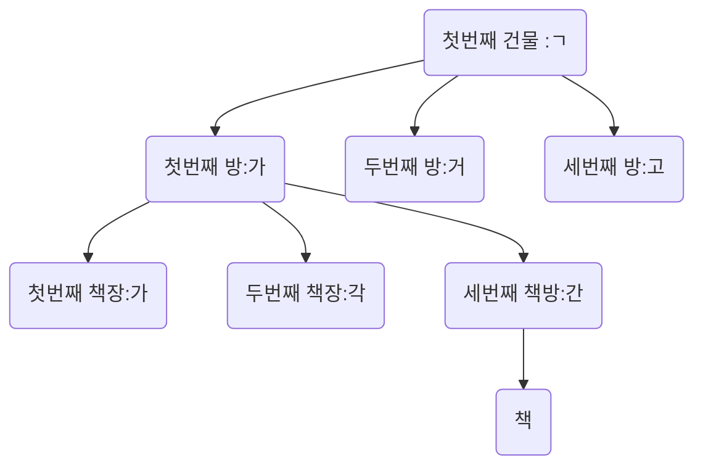

# Index

- 색인

## 얻을 수 있는 장점

- MySQL이 데이터를 빠르게 찾을 수 있다.
  - SELECT가 빨라진다.

## 단점

- 용량을 더 차지한다.(약 10%)
- SELECT 이외의 DML이 느려진다.(무거워진다.)

# 색인

- 내용 중에서 중요한 단어나 항목, 인명 따위를 쉽게 찾아볼 수 있도록 일정한 순서에 따라 별도로 배열하여 놓은 목록

## Index를 설정하면

- 설정에 맞춰서 목록을 생성

# 사용 이유

- 왜 빨리 찾아야 할까?

| num | name   |
| --- | ------ |
| 1   | 김강문 |
| 2   | 박성민 |
| 3   | 방지완 |

# Index를 자동으로 해주는 키

- UNIQUE
- PRIMARY KEY
- FOREIGN KEY

# Index는 어떻게 빠르게 찾을 수 있고 목록화 하는가

## 자료구조

- 순서대로 정리한다.
- 가나다 순으로 책을 정리한다.
  - 첫번째 건물 : ㄱ => 100만권있음
    - 첫번째 책방 : 가
      첫번째 책장: 가
      두번째 책장: 각
      세번째 책장: 간
    - 두번째 책장 : 거
    - 세번쨰 책장 : 고
  - 두번째 책장 : ㄴ

### B-Tree 구조



# Index test

## CREATE INDEX

```sql
CREATE INDEX idx_board_title ON board_test(title ASC);
```

- ASC: 오름차순
- DESC: 내림차순

# SHOW INDEX

```sql
SHOW INDEX FROM board_test;
```

## DROP INDEX

```sql
DROP INDEX idx_board_title ON board_test;
```
