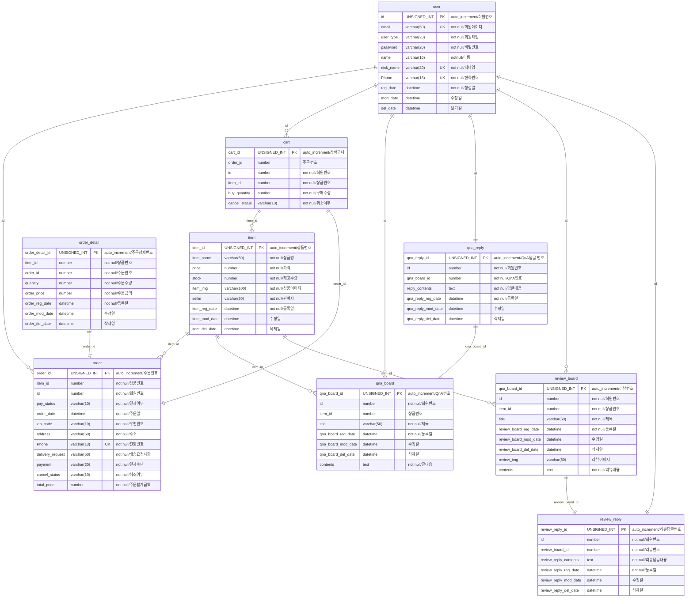

# 쇼핑몰 erd

```mermaid
erDiagram

user {
    id UNSIGNED_INT PK "auto_increment/회원번호"
    email varchar(50) UK "not null/회원아이디"
    user_type varchar(20) "not null/회원타입"
    password varchar(20) "not null/비밀번호"
    name varchar(10) "notnull/이름"
    nick_name varchar(20) UK "not null/닉네임"
    Phone varchar(13) UK "not null/전화번호"
    reg_date datetime "not null/생성일"
    mod_date datetime "수정일"
    del_date datetime "탈퇴일"
}

order {
order_id UNSIGNED_INT PK "auto_increment/주문번호"
item_id number "not null/상품번호"
id number "not null/회원번호"
pay_status varchar(10) "not null/결제여부"
order_date datetime "not null/주문일"
zip_code varchar(10) "not null/우편번호"
address varchar(50) "not null/주소"
Phone varchar(13) UK "not null/전화번호"
delivery_request varchar(50) "not null/배송요청사항"
payment varchar(20) "not null/결제수단"
cancel_status varchar(10) "not null/취소여부"
total_price number "not null/주문합계금액"
}
user ||--o{ order : id

item {
item_id UNSIGNED_INT PK "auto_increment/상품번호"
item_name varchar(50) "not null/상품명"
price number "not null/가격"
stock number "not null/재고수량"
item_img varchar(100) "not null/상품이미지"
seller varchar(20) "not null/판매자"
item_reg_date datetime "not null/등록일"
item_mod_date datetime "수정일"
item_del_date datetime "삭제일"
}
item ||--o{ order : item_id

order_detail {
order_detail_id UNSIGNED_INT PK "auto_increment/주문상세번호"
item_id number "not null/상품번호"
order_id number "not null/주문번호"
quantity number "not null/주문수량"
order_price number "not null/주문금액"
order_reg_date datetime "not null/등록일"
order_mod_date datetime "수정일"
order_del_date datetime "삭제일"
}

order_detail ||--|| order : order_id

cart{
cart_id UNSIGNED_INT PK "auto_increment/장바구니"
order_id number "주문번호"
id number "not null/회원번호"
item_id number "not null/상품번호"
buy_quantity number "not null/구매수량"
cancel_status varchar(10) "not null/취소여부"
}

cart ||--o{ item : item_id
user ||--o{ cart : id
cart ||--|| order : order_id

qna_board{
qna_board_id UNSIGNED_INT PK "auto_increment/QnA번호"
id number "not null/회원번호"
item_id number "상품번호"
title varchar(50) "not null/제목"
qna_board_reg_date datetime "not null/등록일"
qna_board_mod_date datetime "수정일"
qna_board_del_date datetime "삭제일"
contents text "not null/글내용"
}
user ||--o{ qna_board : id
item ||--o{ qna_board : item_id

qna_reply{
qna_reply_id UNSIGNED_INT PK "auto_increment/QnA답글 번호"
id number "not null/회원번호"
qna_board_id number "not null/QnA번호"
reply_contents text "not null/답글내용"
qna_reply_reg_date datetime "not null/등록일"
qna_reply_mod_date datetime "수정일"
qna_reply_del_date datetime "삭제일"
}
qna_reply ||--|| qna_board : qna_board_id
user ||--|| qna_reply : id

review_board{
qna_board_id UNSIGNED_INT PK "auto_increment/리뷰번호"
id number "not null/회원번호"
item_id number "not null/상품번호"
title varchar(50) "not null/제목"
review_board_reg_date datetime "not null/등록일"
review_board_mod_date datetime "수정일"
review_board_del_date datetime "삭제일"
review_img varchar(50) "리뷰이미지"
contents text "not null/리뷰내용"
}

item ||--o{ review_board : item_id
user ||--o{ review_board : id

review_reply{
review_reply_id UNSIGNED_INT PK "auto_increment/리뷰답글번호"
id number "not null/회원번호"
review_board_id number "not null/리뷰번호"
review_reply_contents text "not null/리뷰답글내용"
review_reply_reg_date datetime "not null/등록일"
review_reply_mod_date datetime "수정일"
review_reply_del_date datetime "삭제일"
}

review_board ||--|| review_reply : review_board_id
user ||--|| review_reply : id

```
